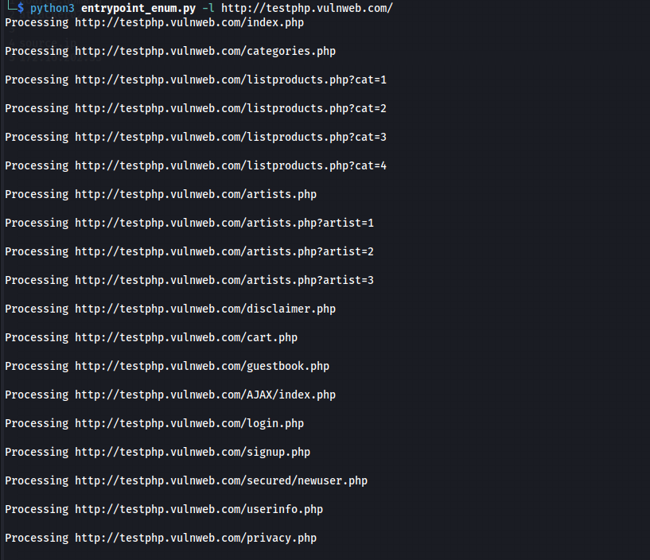
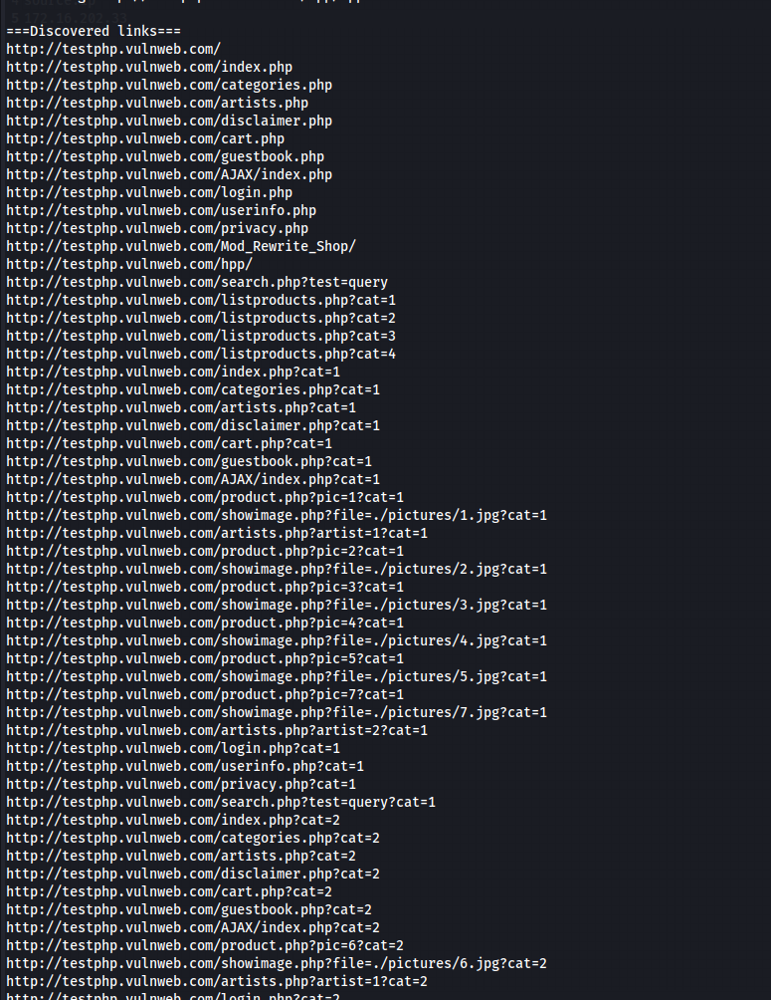
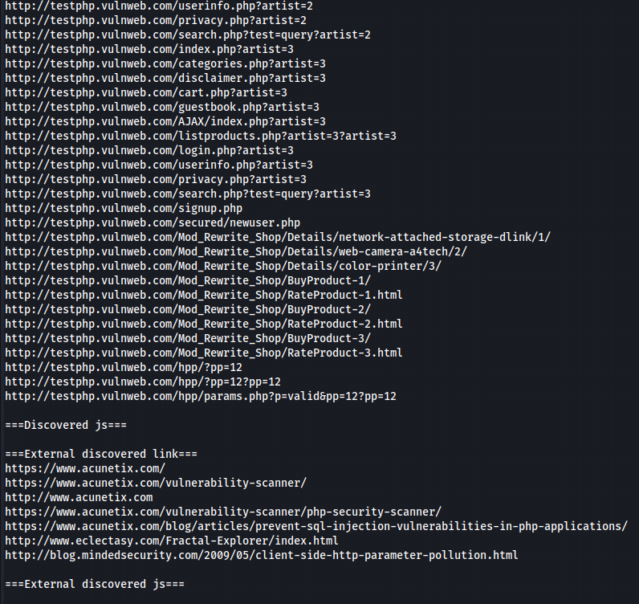

## Project Name: Web Crawler for Identifying Entry Points

### Description
This Python3 script is designed to crawl a web project and identify its entry points. It takes the URL of the project as input along with optional parameters such as cookies and excluded links (e.g., logout URLs). The script then navigates through the project, listing all the links found during the process along with the JavaScript files within the project.

### Features
- Crawl a web project to identify entry points.
- Accepts project URL, headers, and excluded links as inputs.
- Lists all links discovered during navigation (internal and external).
- Identifies JavaScript files within the project (internal and external).

### Usage
1. **Input Parameters**:
   - URL of the web project.
   - Cookies (if required).
   - Other headers (such as user agent) if necessary.
   - Include links in regex format if necessary.
   - Excluded links in regex format (e.g., logout URLs) if necessary.

2. **Output**:
   - List of links found during navigation.
   - List of JavaScript files within the project.

3. **Example Usage**:
```
python3 entrypoint_enum.py -l http://192.168.43.16/DVWA2/ -c '{"PHPSESSID": "ockufsp8jup8j1qc5u13o1kq1f", "security": "low"}' -H '{"User-Agent": "Mozilla/5.0
(X11; Linux x86_64; rv:102.0) Gecko/20100101 Firefox/102.0", "Accept": "text/html,application/xhtml+xml,application/xml;q=0.9,image/avif,image/webp,*/*;q=0.8", "Accept-Language":
"en-US,en;q=0.5", "Accept-Encoding": "gzip, deflate", "Connection": "close", "Upgrade-Insecure-Requests": "1"}' -e http://192.168.43.16/DVWA2/logout.php
```

In the following example, `entrypoint_enum.py` has been run against [http://testphp.vulnweb.com/](http://testphp.vulnweb.com/) : 






